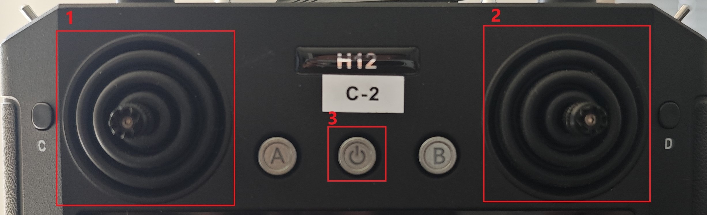
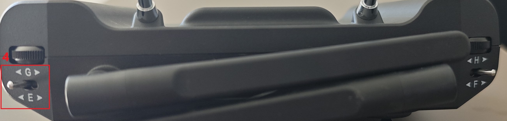
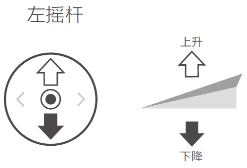
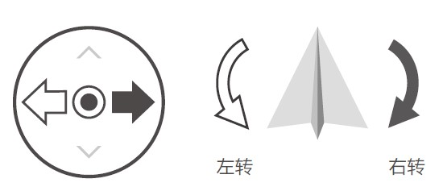
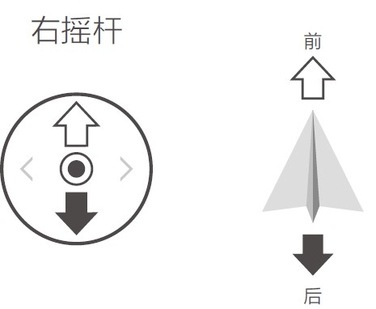
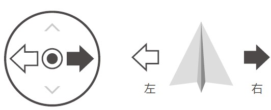
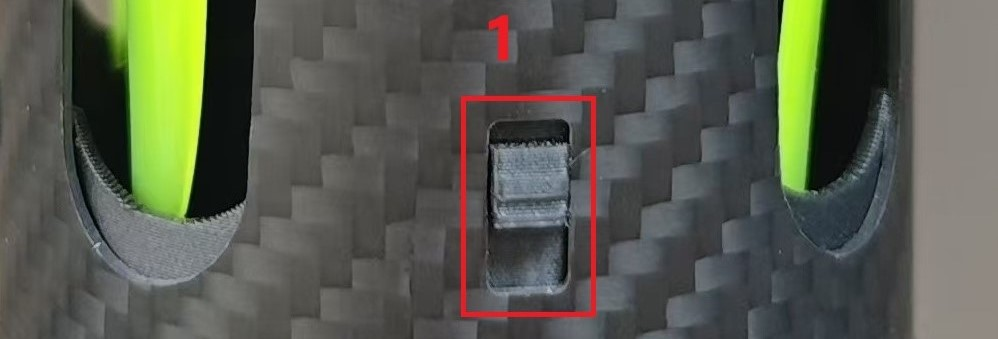
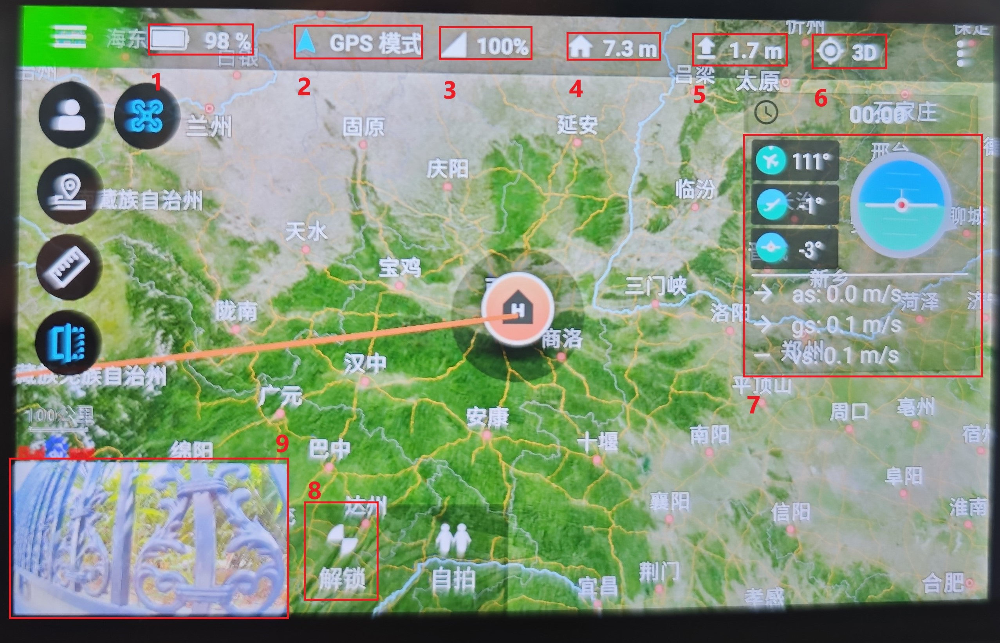
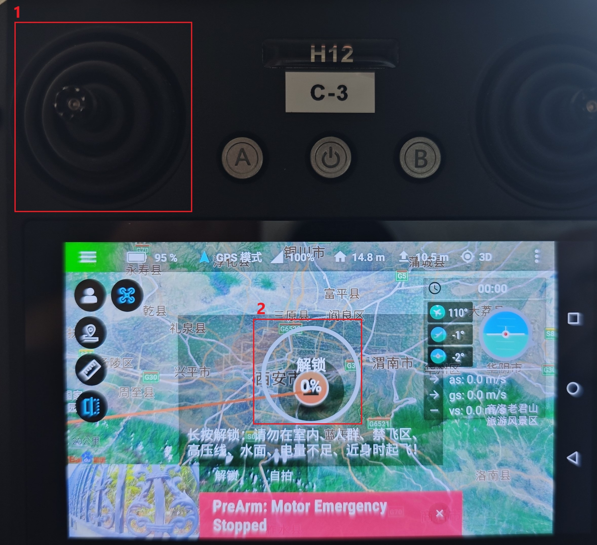

# 飞行手雷使用说明
## 遥控器物理按键功能
*******************

*******************
**以下的这些操作必须人站在飞机后方，飞机机头朝向和人眼朝向为一个方向**
### 1. 1号遥感

    * 油门推杆（前后）
        * 油门推杆用于控制飞行器升降
        * 往上推杆，飞行器升高。往下推杆，飞行器降低。中位时飞行器的高度保持不变(自动定高)
        * 飞行器起飞时，必须将油门杆往上推过中位，飞行器才能离地飞行
        * 请缓慢推杆，以防止飞行器突然上冲

    * 偏航推杆（左右）
        * 偏航杆用于控制飞行器航向
        * 往左打杆，飞行器逆时针旋转。往右打杆，飞行器顺时针旋转。
        * 中位时旋转角速度为零，飞行器不旋转。
        * 摇杆杆量对应飞行器旋转的角速度，杆量越大，旋转的角速度越大。
### 2. 2号遥感

    * 俯仰推杆（前后）
        * 俯仰杆用于控制飞行器前后飞行。
        * 往上推杆，飞行器向前倾斜，并向前飞行。往下拉杆，飞行器向后倾斜，并向后飞行。
        * 中位时飞行器的前后方向保持水平。
        * 摇杆杆量对应飞行器前后倾斜的角度，杆量越大，倾斜的角度越大，飞行的速度也越快。

    * 横滚推杆（左右）
        * 横滚杆用于控制飞行器左右飞行。
        * 往左打杆，飞行器向左倾斜，并向左飞行。往右打杆，飞行器向右倾斜，并向右飞行。
        * 中位时飞行器的左右方向保持水平。
        * 摇杆杆量对应飞行器左右倾斜的角度，杆量越大，倾斜的角度越大，飞行的速度也越快。
### 3. 遥控器开机按键
    * 关机状态长按开机
    * 开启状态长按关机
### 4.飞行模式按键
    * 最左边为GPS模式
    * 中间为定高模式
    * 最右边为自稳模式，非常不建议使用此模式
## 飞行手雷按键说明

**********************

**********************
**以下操作请专业人员操作，或者经过培训人员后使用**
### 1. 机翼展开按钮
    * 将机翼折入机身中后向上推动此按钮，飞机即可完成折叠
    * 折叠完成后向下推动此按键，飞机完成展开
### 2. 飞机开机键
    * 按下关机键后听见嘀嘀嘀的声音证明飞机电源开启
    * 当此按键与机身平行时，飞机电源处于关闭状态
    * 当此按键高于机身时，飞机电源处于开启状态
## 遥控器界面说明
    遥控器开机后先解锁锁屏，然后进入云卓app，选择离线飞行模式，当应用提示更新时，选择暂不更新

### 1. 电池电量
    * 点击此图标可以看见电池的详细信息
    * 当电池低于11.2V时禁止飞行
### 2.飞行模式
    * 优先推荐使用GPS模式
    * 定高和自稳模式非专业人员禁止使用
### 3. 遥控器信号质量
    * 当遥控器信号质量低于30%时，请立即返航
### 4. 飞机离返航点距离
    * 代表当前飞机离返航点距离
    * 请勿飞行太远操作飞行器电量不够无法完成返航
### 5. 飞行器海拔高速
    * 代表当前飞行器与当前海拔高度差
### 6.GPS模式
    * 点击此图标可以看见GPS的详细信息
    * 飞行器飞行时卫星数量不可低于10颗
    * 当此图标显示3D时说明“3D Fix”或“三维定位”。
    * 当此图标显示3D+GPS时说明设备不仅能够进行三维定位还启动了惯性测量单元及高度计进行定位
### 7.飞行姿态
    * 代表当前飞行器飞行速度，俯仰及横滚轴速度
### 8.解锁按钮
    * 点击此按钮后飞行器可进行解锁电机操作
### 9.FPV摄像头
    * 此摄像头用于辅助飞行，帮助辨别飞行器飞行位置
## 飞行器解锁
**此操作未经厂家培训前，请一定拆卸掉螺旋桨后进行，否则会有生命危险！！！！！！！**

**安装准备完成后，请先进行飞行培训或训练。飞行时请选择合适的飞行环境飞行。飞行器飞行限高500m，请勿超过安全飞行高度。飞行时需严格遵守当地法律法规。飞行前务必阅读《安全概要》以了解安全注意事项。**
### 飞行环境要求
1. 恶劣天气下请勿飞行，如大风（风速12m/s及以上）、下雪、下雨、有雾天气等。
2. 选择开阔、周围无高大建筑物的场所作为飞行场地。大量使用钢筋的建筑物会影响指南针工作，而且会遮挡GNSS信号，导致飞行器定位效果变差甚至无法定位。建议飞行器至少距离建筑物5m以上。
3. 飞行时，请保持在视线内控制，远离障碍物、人群、水面（建议距离水面3m以上）等。
4. 请勿在有高压线，通讯基站或发射塔等区域飞行，以免遥控器受到干扰。
5. 在海拔6000m以上飞行，由于环境因素导致飞行器电池及动力系统性能下降，飞行性能将
会受到影响，请谨慎飞行。
6. 在南北极圈内飞行器无法使用GNSS飞行，可以使用视觉系统飞行。
7.如在运动的物体表面上起飞，如行进中的船、汽车等物体，请谨慎飞行。
### 飞行限制及特殊区域限飞
根据国际民航组织和各国空管对空域管制的规定以及对无人机的管理规定，无人机必须在规定的空域中飞行。出于飞行安全考虑，默认开启飞行限制功能，包括高度和距离限制以及特殊区域飞行限制，以帮助用户更加安全合法地使用本产品。

GNSS有效时，特殊区域飞行限制与高度和距离限制共同影响飞行。飞行器在GNSS无效时,仅受高度限制。

限高与限低高度用于限制飞行器的飞行高度，最大半径用于限制飞行器的飞行距离。用户可以
在云卓中设置。

### 飞行前检查
1. 遥控器，电池接移动设备是否电量充足
2. 螺旋桨时候正确安装,**未经专业培训前，不要安装螺旋桨**
3. 前，后机臂是否正确打开
4. 电源开启后相机及舵机是否正常工作
5. 云卓APP是否正常启动
6. 确保摄像头清洁
7. 建议在GPS模式下飞行，以保证稳定性
****************************

#### 确定以上这些动作检查没问题请执行以下的操作解锁

**此时左手推1号遥感向下推到底，同时右手点击图标2解锁按钮，当解锁进度条100%后飞行器完成解锁，此时飞行器可进行飞行**

