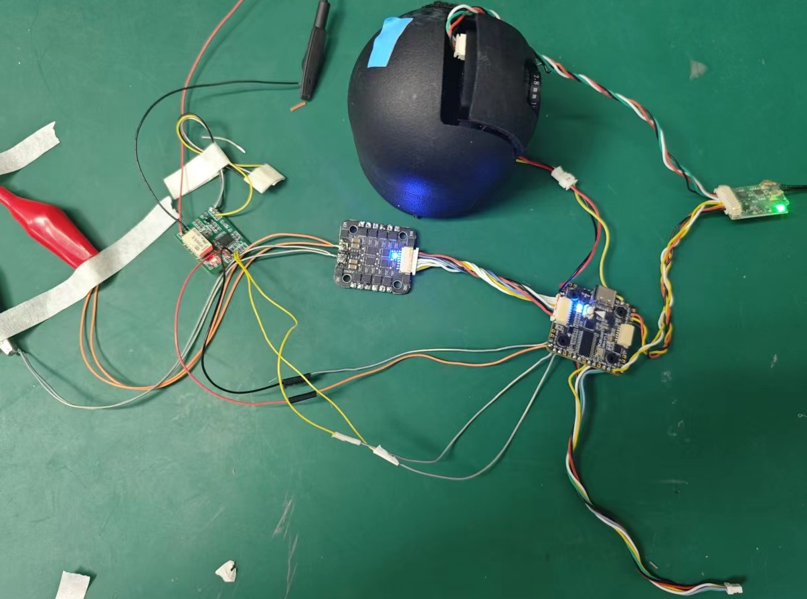
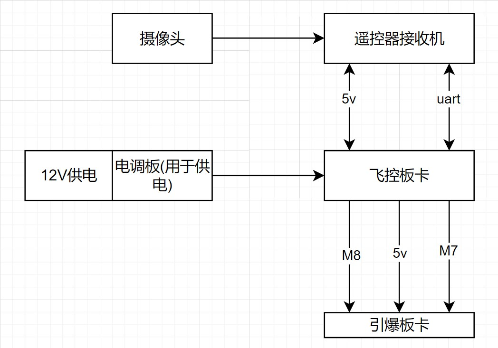
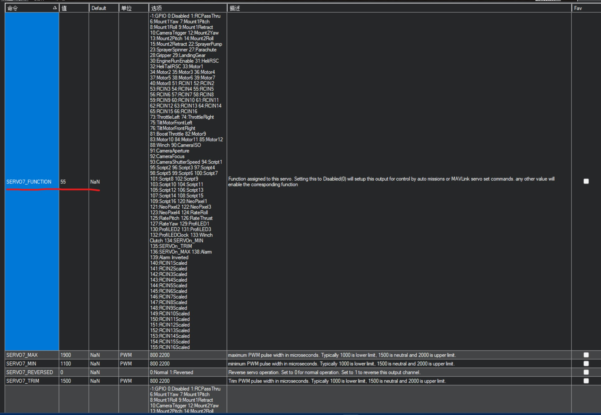
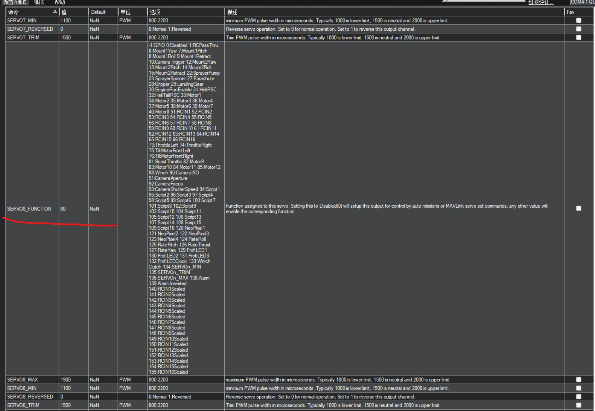
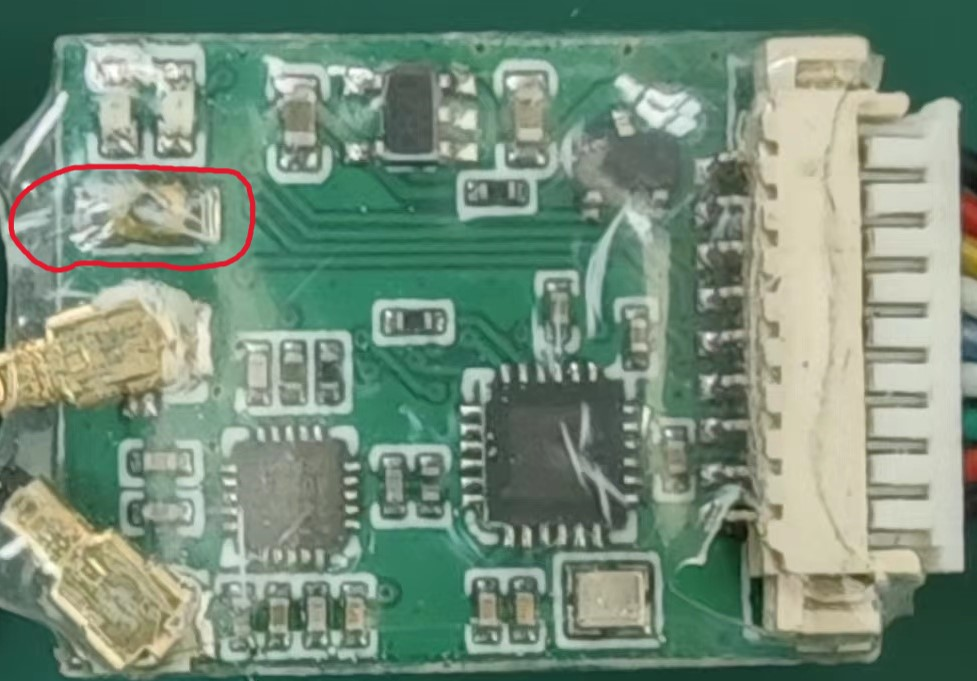

## 引爆配置
### 飞线配置

### 连接关系

#### 引信板卡 -> 飞控
| 引信板卡   | 飞控板卡  |
|:--------  |:------- |
|  J1-4     | M7      |
|  J1-5     | M8      |
|  J1-1     | 5V      |
|  J1-2     | GND     |
#### 软件配置
##### M7通道配置

需要看下7通道对应按下的按键是否为RC5
##### M8通道配置

需要看下8通道对应按下的按键是否为RC10
#### 接收机对频

1. 使用剪头镊子单机触发红色圈圈内的黑色按钮，触发成功后接收机绿灯闪烁
2. 遥控器选择H12助手应用，点击进入后，选择`对频`，进入后选择`开始对频`
3. 当听到嘀嘀嘀三声后并且显示`对频完成`，进入云卓应用，选择`离线飞行`模式，可以看见摄像头的画面
#### 对频失败的处理方法 `当接收机的固件和遥控器不匹配时就需要进行下面的操作`
4. 若点击`开始对频`后，显示`对频失败`，则证明接收机的固件和遥控器不匹配
5. 此时进入H12助手主菜单选择`高级选项`,密码999
6. 选择`升级设备/降级设备`中的`2.升级遥控器/降级遥控器`，中的`检测固件信息`,然后选择`立刻升级/降级`（其中如果选择`升级设备`后，检查固件信息后，`立即升级`字体为灰色，则此时需要切换到`降级设备`，再选择`降级设备`，然后选择`检测固件信息`，此时`立即降级`字体变为白色，然后点击`立即降级`）。
7. 等待升级/降级完成后，听到嘀嘀嘀的声音，表示对频成功。

#### 引爆信号
1. F三档开关
    1. 左-中-右
    2. 右-中
    3. 中-右
    4. 右-中
    5. 中-右
2. 点击D键

